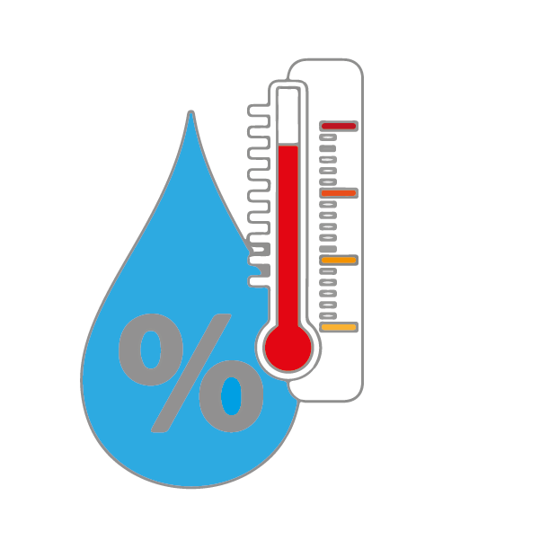
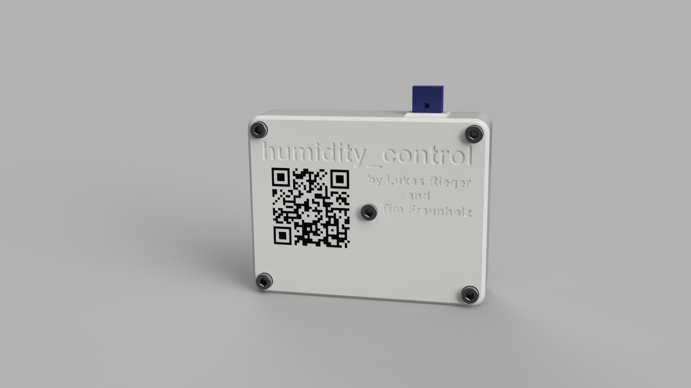
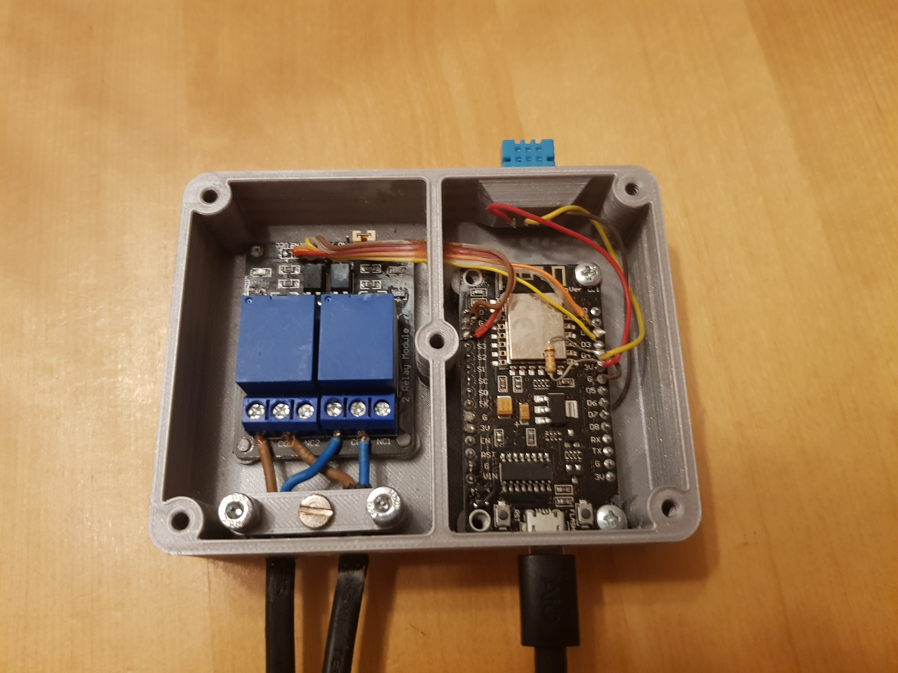

# humidity_control 
## Basics
This project aims at regulating our bathrooms humidity by controlling a dehumidifier. 
The humidity, temperature, current timestamp and the dehumidifier status is written into a database.
Using an UI, the user can observe how these values change over time.  

## Features
### Implemented features
* Measuring the humidity and temperature
* Controlling the dehumidifyer
* Transmitting data to the server, writing into the database
* Saving data up to one day on the ESP, if the database is temporarily unavailable
* Plotting the time series
* 3D printable housing
### Possible future work
* Changing the dehumidifier activation threshold using the UI
* Add Script for Setup
### Intentional limitations
* No secure communication

## Usage
In the ESP code, you have to setup the WiFi connection and the target TCP socket for the database. Follow the instructions in /esp_code/src/README.md.
Make sure the database and server are setup correctly. Adjust the server IP and port in 'configuration.h'.

## Project structure
Here are some directories that may contain interesting files. All of these contain a separate, more detailed readme:
* /3d_objects/: The printable case as STLs.
* /esp_code/: The ESP8266 code measuring values and controlling the dehumidifier.
* /tcpSocket/:
    - Python socket server, that handles incoming data from the ESP. Writes into a database.
    - Python socket server, that handles incoming requests from Frontend, executes a query in the database, formats the result and sends this back to frontend.
* /ui/: The user interface.
* /wiring/: A basic wiring diagram.
* /pics/: Some images.

## Implementation
### Hardware
We used a ESP8266 NodeMCU board as our microcontroller. An AZ-Delivery relay board is used to turn the dehumidifier on and off. We switch both the neutral and the phase wire. We use a DHT11 humidity and temperature sensor due to its low price and its easy availability. If you want a more accurate reading, you could switch to a DHT22, but this would require a 3D model redesign.  

### Mounting
Please refer to the picture below for installing the components and wiring. You need a few short M3 screws and some cables.  
Mount the ESP using M3 screws. The ESP will be powered or programmed using its USB port.  
To hold the relay board in place, you have to install the board and then melt the mounting pins of the case. Connect the power and GND wires to the ESP. Connect the two signal wires to D2 and D3 of the ESP. One relay is for the phase, the other for neutral. Fix the cables using the wire_lid. Please be careful work when working with mains voltage.  

### Sequencediagramm

##### This Chart visualizes the Communication between all Components

### Programming language and environment

Backend, Frontend and Database is running on
**Raspberry Pi 4 Model B 8 GB RAM**

| Component | Programming Language | Framework | In Detail 
| --- | ----------- | --------- | ------- |
| Database | MySQL | |MariaDB
| Backend | Python
| Frontend | Typescript & HTML | Angular & Ionic
| Hardware | C, C++ | Arduino |Esp8266

TODO Web stuff  
TODO database  
The code for the ESP8266 was mostly written using C++ and the Arduino libraries. This greatly simplified the implementation.  

### Testing
