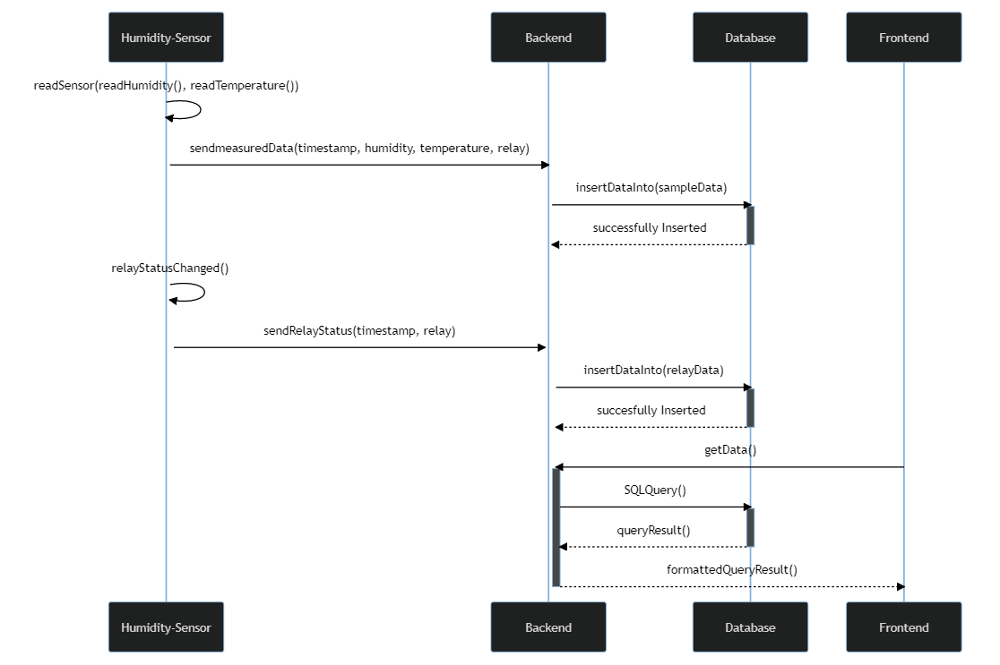

## Getting Started

1. Define [confidentials](confidentials.py) for HOST and PORT
2. Execute the [backendServer](backendServer.py)
3. The according UI Handler can be found here [middleEndServer](middleEndServer.py).

## Sequencediagramm
\

